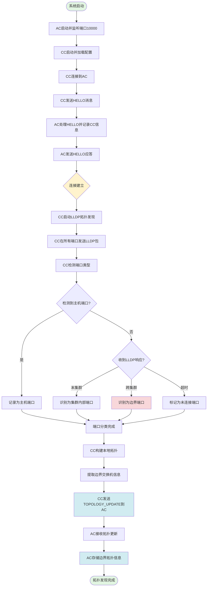
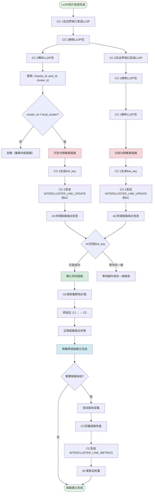
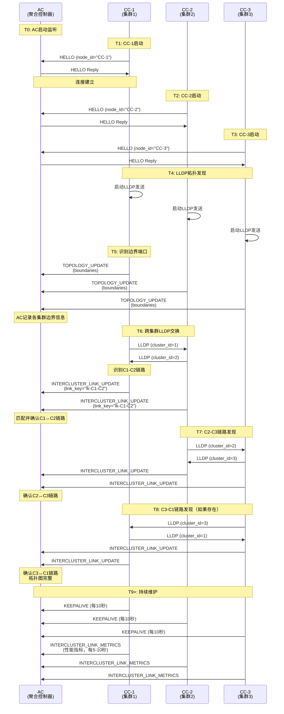

# 拓扑发现与跨域链路建立流程图

## 目录

1. [拓扑发现流程](#1-拓扑发现流程)
2. [跨域链路建立流程](#2-跨域链路建立流程)
3. [完整的系统初始化与链路发现流程](#3-完整的系统初始化与链路发现流程)
4. [时序图](#4-时序图)

---

## 1. 拓扑发现流程

### 1.1 拓扑发现总体流程图



### 1.2 详细步骤说明

#### 步骤1: 系统初始化

**AC端初始化：**
```
AC启动
├─ 初始化SyncProtocol
├─ 初始化ThreadSafeStateManager
├─ 监听TCP端口（默认10000）
├─ 启动心跳监控线程
└─ 等待CC连接
```

**CC端初始化：**
```
CC启动
├─ 读取配置文件（cluster_id, AC地址等）
├─ 加载静态主机配置（如果有）
├─ 初始化LLDP发现模块
├─ 连接到AC
└─ 发送HELLO消息
```

#### 步骤2: 握手建立连接

**HELLO消息交换：**
```
CC → AC: HELLO
{
  type: HELLO
  body: {
    node_id: "CC-1"
    version: "1.0"
  }
}

AC → CC: HELLO Reply
{
  type: HELLO
  body: {
    node_id: "AC"
    version: "1.0"
  }
}
```

#### 步骤3: LLDP拓扑发现

**LLDP发送：**
```
CC在每个端口发送LLDP包
├─ Ethernet Header: dst=01:80:c2:00:00:0e, src=port_mac
├─ LLDP TLV:
│   ├─ Chassis ID TLV: dpid
│   ├─ Port ID TLV: port_no
│   ├─ TTL TLV: 120秒
│   └─ Custom TLV: cluster_id
└─ 周期: 每2秒发送一次
```

**端口分类逻辑：**
```python
def classify_port(port, lldp_response):
    if no_lldp_response and has_traffic:
        return "HOST_PORT"  # 主机端口
    elif lldp_chassis_id in local_switches:
        return "INTERNAL_PORT"  # 集群内部端口
    elif lldp_cluster_id != local_cluster_id:
        return "BOUNDARY_PORT"  # 边界端口（跨集群）
    else:
        return "UNKNOWN_PORT"
```

#### 步骤4: 边界拓扑上报

**TOPOLOGY_UPDATE消息：**
```
CC → AC: TOPOLOGY_UPDATE
{
  cluster_id: 1
  boundaries: [
    {
      switch_id: "dpid:00000c826821c8a4"  # 边界交换机DPID
      ports: [
        {
          port_no: 7              # 边界端口号
          link_key: "lk-xxx"      # 链路标识（用于后续匹配）
          peer_hint: ""           # 对端信息（如已知）
        }
      ]
    }
  ]
}
```

**AC处理：**
```
AC接收TOPOLOGY_UPDATE
├─ 验证cluster_id
├─ 存储边界交换机列表
├─ 存储边界端口信息
└─ 准备接收跨集群链路信息
```

---

## 2. 跨域链路建立流程

### 2.1 跨域链路建立总体流程图



### 2.2 详细步骤说明

#### 阶段1: LLDP包交换

**CC-1发送LLDP：**
```
时刻 T0: CC-1在端口7发送LLDP
┌────────────────────────────────────┐
│ Ethernet Frame                      │
├────────────────────────────────────┤
│ dst: 01:80:c2:00:00:0e (LLDP组播)  │
│ src: 0c:82:68:21:c8:a4 (端口MAC)   │
│ ethertype: 0x88cc (LLDP)           │
├────────────────────────────────────┤
│ LLDP Payload:                      │
│ - Chassis ID: dpid:00000c826821c8a4│
│ - Port ID: 7                       │
│ - TTL: 120                         │
│ - System Name: "CC-1-sw1"          │
│ - Custom TLV:                      │
│   └─ cluster_id: 1                 │
└────────────────────────────────────┘
        ↓ (通过无线adhoc网络)
时刻 T0+RTT: CC-2端口1接收
```

**CC-2接收处理：**
```python
# CC-2的LLDP处理逻辑
def handle_lldp_packet(pkt, in_port):
    chassis_id = extract_chassis_id(pkt)
    port_id = extract_port_id(pkt)
    peer_cluster_id = extract_custom_tlv(pkt, 'cluster_id')
    
    if peer_cluster_id != self.cluster_id:
        # 识别为跨集群链路
        local_dpid = self.dpid
        local_port = in_port
        
        # 生成链路标识
        link_key = generate_link_key(
            local_dpid, local_port,
            chassis_id, port_id
        )
        
        # 记录对端MAC地址（用于underlay转发）
        peer_mac = pkt.src
        self._boundary_ports[in_port] = {
            'peer_dpid': chassis_id,
            'peer_port': port_id,
            'peer_cluster': peer_cluster_id,
            'peer_mac': peer_mac,
            'link_key': link_key
        }
        
        # 向AC报告
        send_intercluster_link_update(link_key, ...)
```

#### 阶段2: 链路标识生成

**link_key生成算法：**
```python
def generate_link_key(local_dpid, local_port, peer_dpid, peer_port):
    """
    生成标准化的链路标识，确保双向一致
    
    算法：将两端信息排序后哈希，确保：
    link_key(A→B) == link_key(B→A)
    """
    # 创建两个端点元组
    ep1 = (local_dpid, local_port)
    ep2 = (peer_dpid, peer_port)
    
    # 排序确保一致性
    endpoints = sorted([ep1, ep2])
    
    # 生成标识字符串
    key_str = f"lk-{endpoints[0][0]}:{endpoints[0][1]}-{endpoints[1][0]}:{endpoints[1][1]}"
    
    return key_str

# 示例：
# CC-1: link_key = "lk-13754232326308:7-66274971307137:1"
# CC-2: link_key = "lk-13754232326308:7-66274971307137:1"  (相同!)
```

#### 阶段3: 链路信息上报

**INTERCLUSTER_LINK_UPDATE消息：**
```
CC-1 → AC: INTERCLUSTER_LINK_UPDATE
{
  cluster_id: 1
  links: [
    {
      switch_id: "dpid:00000c826821c8a4"
      port_no: 7
      link_key: "lk-13754232326308:7-66274971307137:1"
      peer_dpid: "dpid:003c46d81f4c81"
      peer_port: 1
      peer_cluster: 2
    }
  ]
}

CC-2 → AC: INTERCLUSTER_LINK_UPDATE
{
  cluster_id: 2
  links: [
    {
      switch_id: "dpid:003c46d81f4c81"
      port_no: 1
      link_key: "lk-13754232326308:7-66274971307137:1"  # 相同的link_key!
      peer_dpid: "dpid:00000c826821c8a4"
      peer_port: 7
      peer_cluster: 1
    }
  ]
}
```

#### 阶段4: AC链路匹配

**AC链路匹配逻辑：**
```python
class AggregationController:
    def __init__(self):
        self._pending_links = {}  # link_key → [端点信息列表]
        self._confirmed_links = {}  # link_key → 完整链路信息
    
    def handle_intercluster_link_update(self, msg):
        cluster_id = msg.cluster_id
        
        for link in msg.links:
            link_key = link.link_key
            endpoint = {
                'cluster_id': cluster_id,
                'switch_id': link.switch_id,
                'port_no': link.port_no,
                'peer_cluster': link.peer_cluster,
                'peer_dpid': link.peer_dpid,
                'peer_port': link.peer_port
            }
            
            if link_key not in self._pending_links:
                # 第一个端点报告
                self._pending_links[link_key] = [endpoint]
                self._set_timeout(link_key, 30)  # 30秒超时
            else:
                # 第二个端点报告，匹配成功
                endpoints = self._pending_links[link_key]
                endpoints.append(endpoint)
                
                # 验证一致性
                if self._verify_link_consistency(endpoints):
                    # 确认链路
                    self._confirm_intercluster_link(link_key, endpoints)
                    del self._pending_links[link_key]
                else:
                    logger.error(f"Link {link_key} inconsistent!")
    
    def _confirm_intercluster_link(self, link_key, endpoints):
        """确认跨集群链路并更新拓扑图"""
        ep1, ep2 = endpoints
        c1, c2 = ep1['cluster_id'], ep2['cluster_id']
        
        # 更新集群拓扑图
        self._cluster_graph.add_edge(c1, c2)
        
        # 记录链路详情
        self._confirmed_links[link_key] = {
            'cluster1': c1,
            'cluster2': c2,
            'endpoint1': ep1,
            'endpoint2': ep2,
            'status': 'active',
            'metrics': {}
        }
        
        logger.info(f"✓ Confirmed inter-cluster link: C{c1} ←→ C{c2}")
```

#### 阶段5: 拓扑图更新

**集群拓扑图结构：**
```
AC的集群拓扑图（抽象视图）
┌─────────────────────────────────────┐
│         ClusterGraph                │
├─────────────────────────────────────┤
│ Nodes: {1, 2, 3, ...}              │
│ Edges: {                           │
│   (1,2): {                         │
│     link_key: "lk-xxx",            │
│     endpoints: [...],              │
│     metrics: {                     │
│       latency: 17.9 ms,            │
│       loss: 0.04,                  │
│       load: 0.3                    │
│     }                              │
│   },                               │
│   (2,3): {...},                    │
│   ...                              │
│ }                                  │
└─────────────────────────────────────┘
```

---

## 3. 完整的系统初始化与链路发现流程

### 3.1 时间线视图

```
时刻 T0: AC启动
├─ 监听端口10000
└─ 初始化完成

时刻 T1: CC-1启动
├─ 连接AC
├─ HELLO握手 (T1 ~ T1+100ms)
└─ 启动LLDP发现

时刻 T2: CC-2启动
├─ 连接AC
├─ HELLO握手 (T2 ~ T2+100ms)
└─ 启动LLDP发现

时刻 T3: 第一轮LLDP交换
├─ CC-1发送LLDP → CC-2接收 (T3 ~ T3+RTT)
├─ CC-2发送LLDP → CC-1接收 (T3 ~ T3+RTT)
└─ 识别跨集群链路

时刻 T4: 链路信息上报
├─ CC-1 → AC: INTERCLUSTER_LINK_UPDATE
├─ CC-2 → AC: INTERCLUSTER_LINK_UPDATE
└─ AC匹配并确认链路

时刻 T5: 拓扑发现完成
├─ AC更新集群拓扑图
├─ 添加边: C1 ←→ C2
└─ 准备处理跨域路由请求

时刻 T6+: 持续运行
├─ LLDP周期发送（每2秒）
├─ 链路指标上报（每5-10秒）
└─ 心跳监控（每10秒）
```

### 3.2 多集群场景完整流程



---

## 4. 时序图

### 4.1 单链路建立详细时序

```
CC-1 (Cluster 1)          无线网络           CC-2 (Cluster 2)             AC (聚合控制器)
     |                       |                      |                           |
     |                                              |                           |
T0   |--- LLDP (cluster_id=1) ------------------>  |                           |
     |   [chassis_id, port_id, cluster_id]         |                           |
     |                                              |                           |
T0+5 |                                           解析LLDP                       |
     |                                           识别跨集群链路                  |
     |                                           生成link_key                  |
     |                                              |                           |
T0+10|                                              |--- INTERCLUSTER_LINK ---->|
     |                                              |    UPDATE (端点1)         |
     |                                              |                           |
T1   |  <-------------------- LLDP (cluster_id=2)--|                       存储端点1
     |                                              |                       等待端点2
T1+5 解析LLDP                                       |                           |
     识别跨集群链路                                  |                           |
     生成link_key (相同!)                           |                           |
     |                                              |                           |
T1+10|--- INTERCLUSTER_LINK_UPDATE (端点2) ----------------------->|           |
     |                                              |              匹配link_key |
     |                                              |              验证一致性    |
     |                                              |              确认链路     |
     |                                              |              更新图: C1↔C2|
     |                                              |                           |
T1+15|                                              |              [链路建立完成]|
     |                                              |                           |
     |                                                                          |
     继续LLDP周期发送                             继续LLDP周期发送              |
     (每2秒)                                      (每2秒)                       |
     |                                              |                           |
```

### 4.2 故障场景处理

**场景1: 单端报告超时**
```
T0   CC-1 → AC: INTERCLUSTER_LINK_UPDATE (link_key="lk-xxx")
     AC: 存储端点信息，设置30秒超时

T0+30 超时触发
     AC: 删除pending链路 "lk-xxx"
     AC: 记录日志：单端链路报告，可能的原因：
         - 对端CC未启动
         - 链路单向故障
         - LLDP包丢失
```

**场景2: 链路故障检测**
```
T0   链路C1↔C2正常运行
     LLDP周期性交换

T100 无线链路故障
     CC-1停止收到CC-2的LLDP
     CC-2停止收到CC-1的LLDP

T100+TTL (120秒)
     CC-1: 端口7的LLDP信息过期
     CC-1 → AC: INTERCLUSTER_LINK_UPDATE (删除link_key)
     
     CC-2: 端口1的LLDP信息过期
     CC-2 → AC: INTERCLUSTER_LINK_UPDATE (删除link_key)

T100+TTL+Δ
     AC: 收到两端删除通知
     AC: 从拓扑图删除边 C1↔C2
     AC: 触发路由重计算
```

---

## 5. 关键技术点总结

### 5.1 LLDP自定义TLV

**使用Custom TLV传递cluster_id：**
```python
# 构造LLDP包
def build_lldp_packet(dpid, port_no, cluster_id):
    lldp_pkt = lldp.lldp()
    
    # 标准TLV
    lldp_pkt.tlvs = [
        lldp.ChassisID(subtype=lldp.ChassisID.SUB_LOCALLY_ASSIGNED,
                       chassis_id=dpid.encode()),
        lldp.PortID(subtype=lldp.PortID.SUB_PORT_COMPONENT,
                    port_id=str(port_no).encode()),
        lldp.TTL(ttl=120),
    ]
    
    # 自定义TLV: cluster_id
    cluster_tlv = lldp.OrganizationallySpecific(
        oui=b'\x00\x12\x0f',  # 自定义OUI
        subtype=7,            # subtype for cluster_id
        info=struct.pack('!I', cluster_id)  # 4字节cluster_id
    )
    lldp_pkt.tlvs.append(cluster_tlv)
    lldp_pkt.tlvs.append(lldp.End())
    
    return lldp_pkt
```

### 5.2 Link Key生成确保双向一致

**算法关键点：**
1. 提取两端信息：(dpid1, port1, dpid2, port2)
2. 排序端点：确保 endpoint_A < endpoint_B
3. 生成字符串：`"lk-{A}-{B}"`
4. 结果：无论哪一端生成，link_key相同

**示例：**
```
CC-1视角：local=(0x0c826821c8a4, 7), peer=(0x3c46d81f4c81, 1)
  排序后：(0x0c826821c8a4, 7) < (0x3c46d81f4c81, 1)
  link_key = "lk-13754232326308:7-66274971307137:1"

CC-2视角：local=(0x3c46d81f4c81, 1), peer=(0x0c826821c8a4, 7)
  排序后：(0x0c826821c8a4, 7) < (0x3c46d81f4c81, 1)
  link_key = "lk-13754232326308:7-66274971307137:1"  # 相同!
```

### 5.3 AC链路匹配的可靠性

**机制：**
1. **Pending状态**：第一个端点报告后，进入pending状态
2. **超时机制**：30秒超时，防止孤立端点长期占用资源
3. **一致性验证**：两端信息必须互相匹配
4. **原子确认**：匹配成功后原子性更新拓扑图

**验证逻辑：**
```python
def _verify_link_consistency(self, endpoints):
    """验证两个端点信息的一致性"""
    ep1, ep2 = endpoints
    
    # 验证1：互为对端
    if ep1['peer_cluster'] != ep2['cluster_id']:
        return False
    if ep2['peer_cluster'] != ep1['cluster_id']:
        return False
    
    # 验证2：DPID和端口匹配
    if ep1['peer_dpid'] != ep2['switch_id']:
        return False
    if ep2['peer_dpid'] != ep1['switch_id']:
        return False
    if ep1['peer_port'] != ep2['port_no']:
        return False
    if ep2['peer_port'] != ep1['port_no']:
        return False
    
    return True
```

### 5.4 实际部署示例

**3集群环形拓扑：**
```
     Cluster 1
    (10.10.0.0/24)
         |
    [无线链路]
         |
     Cluster 3  ←--[无线链路]--→  Cluster 2
   (10.30.0.0/24)              (10.20.0.0/24)
```

**链路建立顺序：**
```
T0+2s:  C1↔C3 链路发现并确认
T0+4s:  C2↔C3 链路发现并确认
T0+6s:  C1↔C2 链路发现并确认（如果存在直连）
T0+8s:  所有链路建立完成，拓扑图构建完毕
```

---

## 6. 相关协议消息参考

详细的协议消息定义请参考：
- **协议定义：** `ryu/custom/protocol/message.proto`
- **协议文档：** `ryu/custom/docs/EAST_WEST_PROTOCOL_DESIGN.md`
- **实现代码：** `ryu/custom/controller/cc_controller.py` (LLDP处理)
- **实现代码：** `ryu/custom/controller/ac_controller.py` (链路匹配)

---

## 附录：ASCII艺术流程图

### 附录A: 拓扑发现ASCII流程图

```
┌─────────────────┐
│   系统启动      │
└────────┬────────┘
         │
    ┌────▼────┐         ┌──────────┐
    │AC启动并 │         │CC启动并  │
    │监听端口 │         │加载配置  │
    └────┬────┘         └────┬─────┘
         │                   │
         │        ┌──────────▼──────────┐
         │        │ CC连接AC并发送HELLO │
         │        └──────────┬──────────┘
         │                   │
    ┌────▼───────────────────▼────┐
    │ AC处理HELLO，建立连接       │
    │ AC发送HELLO应答             │
    └────────────┬────────────────┘
                 │
         ┌───────▼────────┐
         │ CC启动LLDP发现 │
         └───────┬────────┘
                 │
         ┌───────▼────────┐
         │ 在所有端口发送 │
         │    LLDP包      │
         └───────┬────────┘
                 │
         ┌───────▼────────┐
         │  检测端口类型  │
         └───────┬────────┘
                 │
         ┌───────▼────────┐
         │ 主机  │ 内部 │ 边界 │
         │ 端口  │ 端口 │ 端口 │
         └───┬───┴───┬──┴───┬──┘
             │       │      │
             └───────┼──────┘
                     │
             ┌───────▼────────┐
             │ 构建本地拓扑   │
             └───────┬────────┘
                     │
             ┌───────▼────────┐
             │ 提取边界信息   │
             └───────┬────────┘
                     │
             ┌───────▼────────┐
             │ 发送TOPOLOGY_  │
             │   UPDATE到AC   │
             └───────┬────────┘
                     │
             ┌───────▼────────┐
             │ AC存储边界拓扑 │
             └───────┬────────┘
                     │
             ┌───────▼────────┐
             │ 拓扑发现完成   │
             └────────────────┘
```

### 附录B: 跨域链路建立ASCII流程图

```
                    ┌─────────────────────┐
                    │ LLDP拓扑发现完成    │
                    └──────────┬──────────┘
                               │
           ┌───────────────────┴────────────────────┐
           │                                        │
     ┌─────▼─────┐                          ┌──────▼──────┐
     │ CC-1发送  │                          │  CC-2发送   │
     │  LLDP包   │                          │   LLDP包    │
     └─────┬─────┘                          └──────┬──────┘
           │                                        │
     ┌─────▼──────────┐                   ┌────────▼─────┐
     │ CC-2接收LLDP   │                   │ CC-1接收LLDP │
     │ 解析并识别     │                   │ 解析并识别   │
     │ 跨集群链路     │                   │ 跨集群链路   │
     └─────┬──────────┘                   └────────┬─────┘
           │                                        │
     ┌─────▼──────────┐                   ┌────────▼─────┐
     │ 生成link_key   │                   │生成link_key  │
     │ (相同值)       │                   │ (相同值)     │
     └─────┬──────────┘                   └────────┬─────┘
           │                                        │
     ┌─────▼──────────────┐             ┌──────────▼──────┐
     │ CC-2发送           │             │ CC-1发送        │
     │ INTERCLUSTER_LINK  │             │ INTERCLUSTER_   │
     │ _UPDATE到AC        │             │ LINK_UPDATE到AC │
     └─────┬──────────────┘             └──────────┬──────┘
           │                                        │
           └───────────────────┬────────────────────┘
                               │
                     ┌─────────▼─────────┐
                     │  AC接收两端报告   │
                     │  根据link_key匹配 │
                     └─────────┬─────────┘
                               │
                     ┌─────────▼─────────┐
                     │  验证链路一致性   │
                     └─────────┬─────────┘
                               │
                     ┌─────────▼─────────┐
                     │  确认双向链路     │
                     └─────────┬─────────┘
                               │
                     ┌─────────▼─────────┐
                     │  更新集群拓扑图   │
                     │  添加边: C1 ←→ C2│
                     └─────────┬─────────┘
                               │
                     ┌─────────▼─────────┐
                     │ 链路建立完成      │
                     └───────────────────┘
```

---

**文档版本：** v1.0
**最后更新：** 2026-03-04
**相关文档：** EAST_WEST_PROTOCOL_DESIGN.md
